# Unicorn-Startup-Analysis-EDA-Project

# 📊 EXPLORING UNICORN STARTUP DATA USING PYTHON

**Branch:** ENTC A3  


# **Project Name:** Unicorn Startup Analysis using Python  

---

## 📌 Project Overview

This project performs **Exploratory Data Analysis (EDA)** on unicorn startups to identify patterns in valuation, funding, industry dominance, and global distribution using Python.

---

## 📌 Aim

To analyze unicorn startup data using statistical and visualization techniques to extract meaningful insights.

---

## 🎯 Objectives

- Analyze startup distribution across countries  
- Identify top industries  
- Study valuation and funding relationships  
- Visualize trends using graphs  
- Perform statistical analysis  

---

## 📊 Data Source

- Public dataset (Kaggle / online sources)

---

## 🛠️ Tools Used

Python, Pandas, NumPy, Matplotlib, Seaborn, Jupyter Notebook  

---

## 🔄 Project Workflow

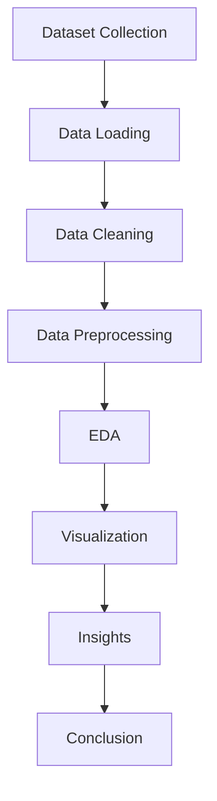

---

# ⚙️ Algorithms & Flowcharts

---

## 1️⃣ Data Loading

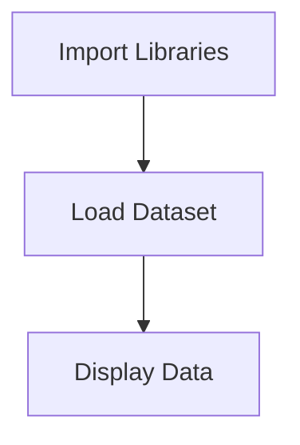

---

## 2️⃣ Data Cleaning

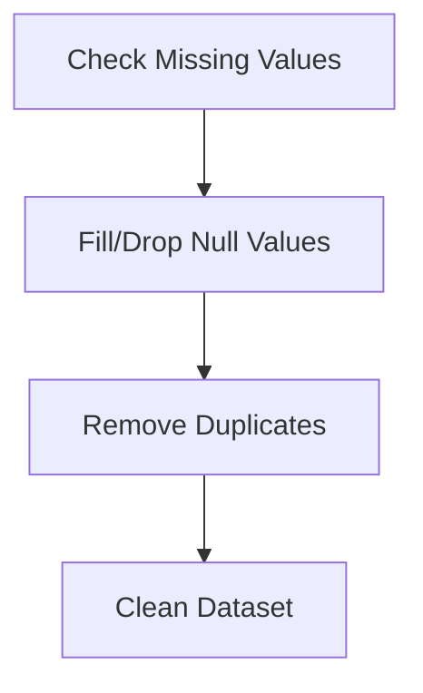

---

## 3️⃣ Data Type Conversion

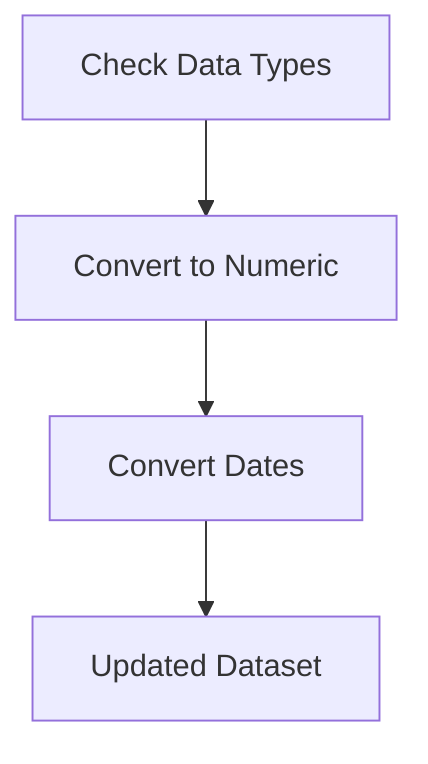

---

## 4️⃣ Feature Selection

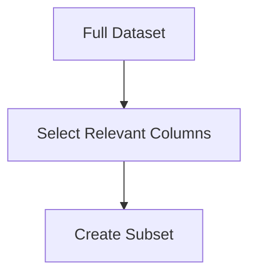

---

## 5️⃣ Statistical Summary

```mermaid
flowchart TD
A[Dataset]
--> B[Apply describe()]
--> C[Mean/Median/Std]
--> D[Interpret Stats]
```

---

## 6️⃣ Country-wise Bar Chart

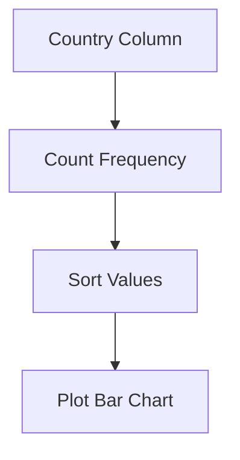

---

## 7️⃣ Industry-wise Pie Chart

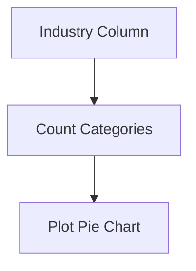

---

## 8️⃣ Year-wise Growth (Line Graph)

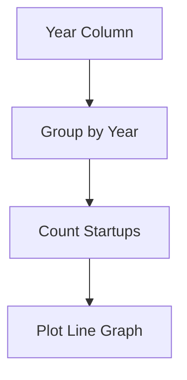

---

## 9️⃣ Valuation Histogram

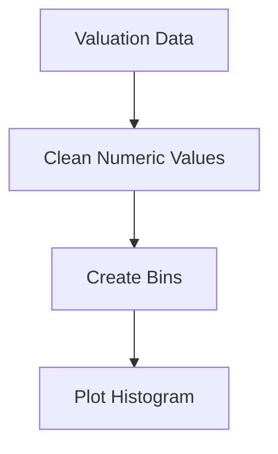

---

## 🔟 Box Plot (Outlier Detection)

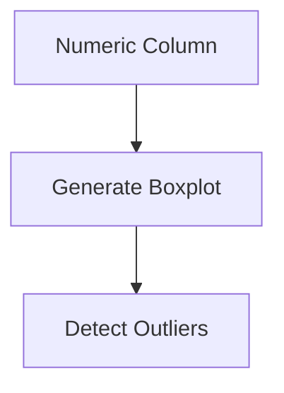

---

## 1️⃣1️⃣ Funding vs Valuation Scatter Plot

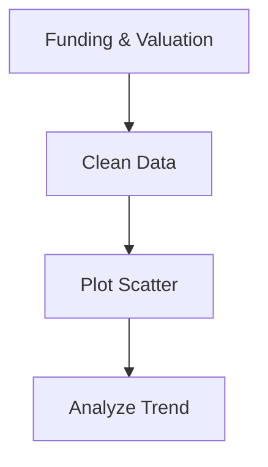

---

## 1️⃣2️⃣ Correlation Heatmap

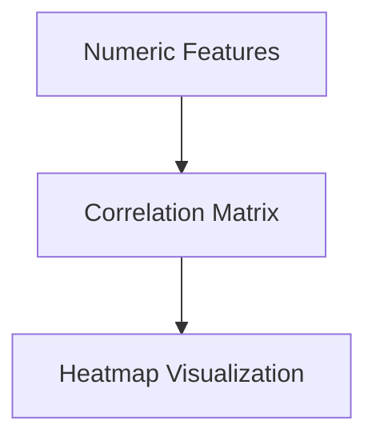

---

## 1️⃣3️⃣ Pair Plot (Multi-variable Analysis)

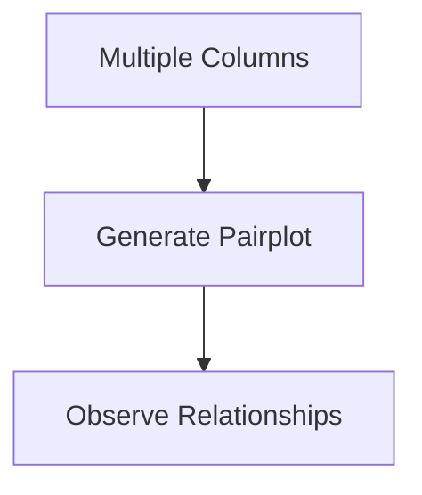

---

## 1️⃣4️⃣ Top N Analysis

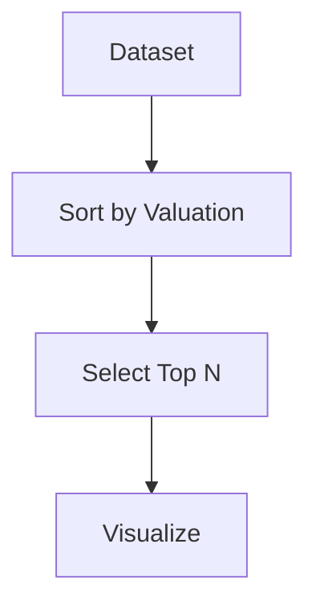

---

## 1️⃣5️⃣ Trend Analysis

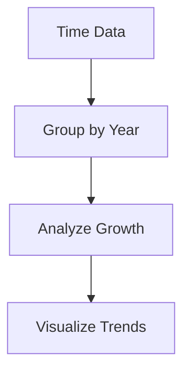

---

## 📊 Features

### 📈 Visualizations Included

#### 🔹 Basic Charts
- Bar Chart  
- Line Graph  
- Pie Chart  
- Histogram  

#### 🔹 Advanced Charts
- Heatmap  
- Box Plot  
- Scatter Plot  
- Pair Plot  

---

## 📊 Observations

- Unicorn startups are concentrated in a few countries  
- Tech sector dominates  
- Rapid growth observed in recent years  
- Some companies achieve high valuation with low funding  
- Strong relationships exist between financial variables  

---

## 📊 Results

- Identified global leaders in startup ecosystem  
- Highlighted dominant industries  
- Visualized growth patterns  
- Established funding vs valuation insights  

---

## 📌 Conclusion

This project demonstrates the power of **EDA in uncovering hidden patterns** in real-world datasets. It enables better understanding of startup trends and supports data-driven decision-making.

---

## 🤝 Team Members

- Harshit  
- Khush Chauhan  
- Krishiv Sharma  
- Kshitij Dalvi  

